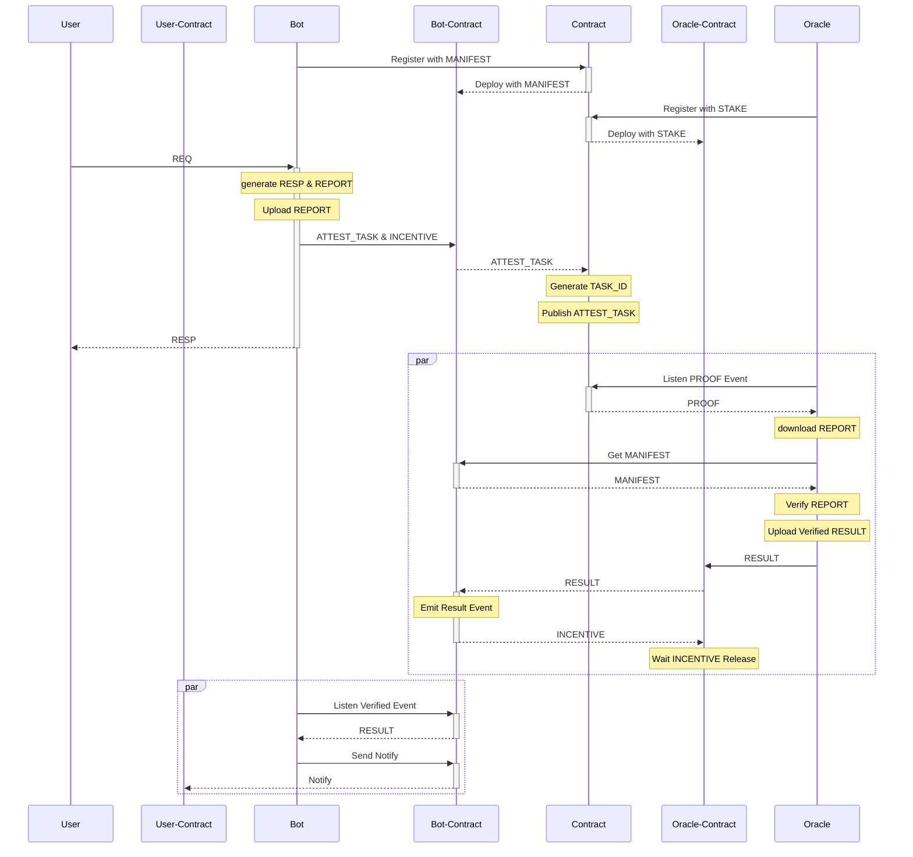

# Attest



## Project structure

-   `contracts`: source code of all the smart contracts of the project and their dependencies.
-   `scripts`: scripts used by the project, mainly the deployment scripts.

## How to use

### Install

Install nodejs: <https://github.com/nodesource/distributions>

```sh
npm i
```

### Build

`npx blueprint build`

### Run

```sh
npx blueprint run --testnet --tonconnect all
```
